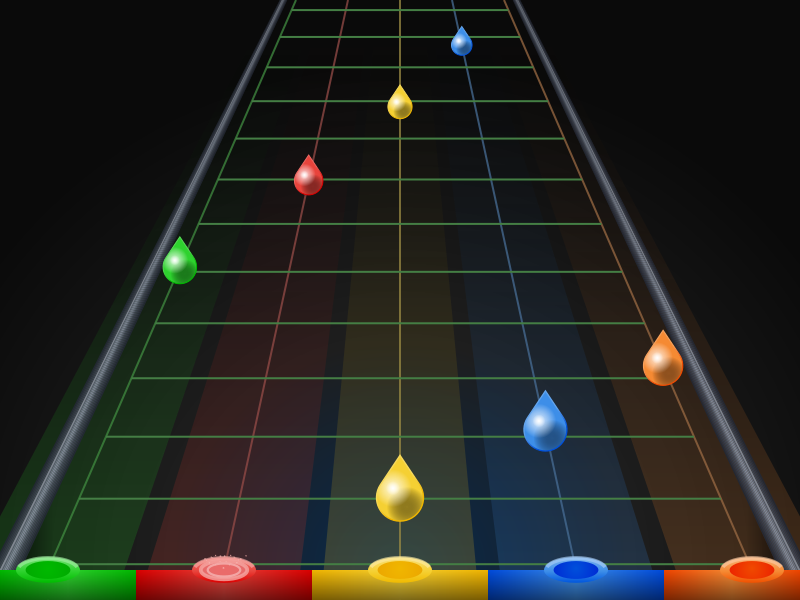
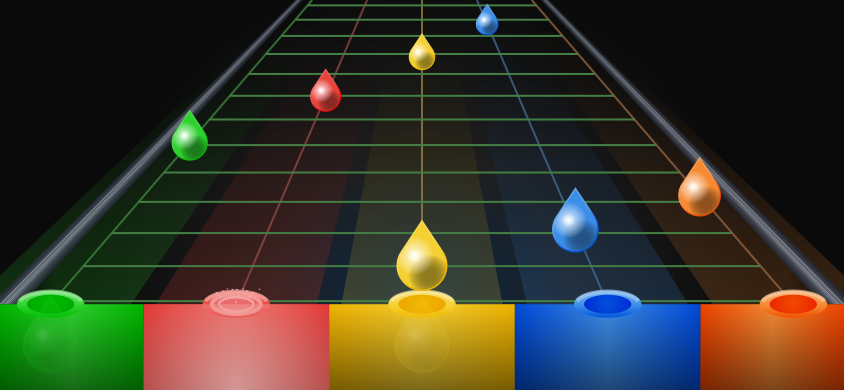

# How to play

In this guide: [Basic flow](#basic-flow) · [Controls](#controls) · [Tap vs. Strum bar](#input-mode-tap-vs-strum-bar) ·
[Goal & difficulty](#goal--difficulty) · [Chords & sustains](#chords-and-long-notes-sustain) ·
[Rock Meter](#rock-meter) · [Star Power](#star-power) · [Results & scoring](#results--scoring) ·
[Friends](#friends)

For remapping keys, themes, graphics quality and your account, see
[`SETTINGS.md`](./SETTINGS.md). For the full achievement list, see
[`ACHIEVEMENTS.md`](./ACHIEVEMENTS.md).

## Basic flow

1. Open the game — you land on the **main menu**. Click **"Single
   Player"** to reach the **song menu**, or **"Friends"** to add
   friends and compare scores (see [Friends](#friends) below).
2. Click a song. A modal opens with the **available difficulties** and,
   if you've already played it, your **best score per difficulty** as
   stars.
3. Click a difficulty — the game **starts playing right away**, no
   "Start" button. If the browser blocks autoplay (happens if loading
   takes too long), a "Tap to start" overlay appears: one click/tap
   fixes it.
4. Play until the song ends or your **Rock Meter** hits 0 (see below).
   You land on a **results screen** either way — see
   [Results & scoring](#results--scoring).
5. To leave early, use the **"« Change song"** button at the top of the
   game screen.

## Controls

Three input methods, auto-detected per device — **touch** on
phones/tablets, **keyboard** everywhere else — and always
overridable in **Options → Controls → Input device**
([`SETTINGS.md`](./SETTINGS.md#controls)).

### Keyboard

Default bindings:

| Key | Lane | Color |
|---|---|---|
| `A` | 1 | 🟢 Green |
| `S` | 2 | 🔴 Red |
| `J` | 3 | 🟡 Yellow |
| `K` | 4 | 🔵 Blue |
| `L` | 5 | 🟠 Orange |
| `Left Shift` | Activate Star Power | — |

Every action is remappable from **Options → Controls** — see
[`SETTINGS.md`](./SETTINGS.md#controls).

### Gamepad

Any device the OS reports as a gamepad works out of the box — including
a PC guitar controller. Map any action to a gamepad button the same way
you'd remap a key, from **Options → Controls**.

### Touch (phone / tablet)

There's no separate row of on-screen buttons — **the colored pipes at
the bottom of the highway are the buttons**: tap a pipe to hit that
lane, keep your finger down through a sustain. In **Tap** mode, tapping
anywhere else in the play area (not on a pipe) hits the **Open** note.
To activate **Star Power**, tap the meter in the top-right corner
instead of pressing a key.

Both orientations are fully playable, no rotation forced — landscape
gives the 5 lanes more horizontal spacing and is generally the more
comfortable one for two-thumb play; portrait works just as well.
Either way the HUD auto-shrinks on small screens so it never overlaps
the highway.

<table>
<tr><td align="center">

Desktop, keyboard

</td><td align="center">

Phone, landscape, touch

</td></tr>
</table>

## Input mode: Tap vs. Strum bar

Also in **Options → Controls**, a toggle switches how notes register —
applies to keyboard, gamepad and touch alike:

- **Tap** (default): pressing the right fret by itself hits the note —
  no strumming needed. Has a dedicated `Space` key for the **Open**
  note (no fret held); on touch, tapping outside any pipe does the
  same.
- **Strum bar**: holding a fret does nothing by itself — you also need
  to strum, `↑`/`↓` by default (remappable, direction doesn't matter;
  on touch, tap anywhere in the play area with a second finger while
  holding a pipe). Closer to how a real guitar controller works: hold
  the right fret(s), then strum to register the hit. There's no
  separate Open key here — an Open note is hit by strumming while
  **no** colored fret is held, same as on real hardware.

The Controls list in Settings only shows the bindings that apply to the
mode you're in.

## Goal & difficulty

Press the right key exactly when the note (drop) reaches the pipe
mouth at the bottom of the screen. The closer to the exact time, the
better the judgment — and the higher the score.

The difficulty chosen in the modal doesn't just change the chart's
note density — it also changes how precise your timing needs to be.
Every difficulty judges a hit as **Perfect** (closest), **Good**
(a bit off), or a **Miss** (too far off to count), with Expert
demanding the tightest timing and Easy the most forgiving. A miss
carries no extra penalty beyond losing the score — the drop just falls
and fades.

## Chords and long notes (sustain)

- **Chords** (two or more notes at the same time): all-or-nothing —
  you need to hit every key in the chord together to score.
- **Sustain** (long note): hold the key down while the "drop line"
  passes. The bonus is proportional to how long you held it correctly
  — releasing before the end still guarantees the partial bonus
  already earned.

## Rock Meter

A meter that starts half-full and tracks how the crowd feels about
your playing: it builds a little on every hit, and drains faster on a
miss or a wrong key — pressing wrong when nothing is actually due
still costs you, just less than an outright miss. Any miss or wrong
press also resets your combo streak.

It runs through four zones, mostly visual except the bottom one:
**Critical** (near empty — one more slip and you fail), **Red**,
**Yellow** (where a song starts), and **Green** (full). Activating
**Star Power while in the critical zone** makes every hit worth much
more — a genuine last-second comeback tool, same as in Guitar Hero
III.

**Reach empty and the song ends immediately** — same as running out
of health in Guitar Hero/Rock Band, no continuing from where you left
off. You land on a "Booed off stage!" screen with **Try again** (same
difficulty, instantly) or **Back to menu**.

## Star Power

- Certain stretches of a song are **Star Power** phrases — hitting
  notes within them fills the meter (top-right corner).
- Once it's charged past its activation threshold, press **Left
  Shift** (keyboard), the mapped gamepad button, or **tap the meter**
  (touch) to activate.
- While active, **score doubles**, and the meter drains gradually on
  its own — the fuller it was when you activated, the longer it lasts.
- Also rescues the **Rock Meter** while it's in the critical zone (see
  above) — worth saving for a near-fail moment.

## Results & scoring

**Finishing** a song shows a full results screen:

| Stat | What it means |
|---|---|
| Score | Total points, boosted by combo multiplier and Star Power |
| Stars (0–5) | Your score against the "ideal score" for the chart — the score a full combo with every note Perfect would earn, at the same combo-multiplier ramp, without Star Power |
| Max combo | Longest streak without a miss or wrong press |
| Accuracy | % of notes hit (Perfect + Good) |
| Perfect / Good / Miss | Count of each judgment |
| Dropped | Sustains released early (only shown if it happened) |

Stars come from `score / idealScore`, not from note accuracy alone: 95%+
of the ideal score earns 5 stars, 80%+ earns 4, 60%+ earns 3, 40%+ earns
2, and any run above 0 earns at least 1. Because the ideal score already
bakes in the multiplier ramp, breaking your combo — whether from missing
a real note or from a wrong press with nothing to hit — costs you real
points (you replay part of the song at a lower multiplier while it rebuilds),
which can cost you a star even at 100% note accuracy.

**Failing** (Rock Meter hit 0) skips the breakdown — you just see your
Score on a "Booed off stage!" screen, always at 0 stars, with **Try
again** or **Back to menu**.

## Friends

Requires being **logged in with Google** (same login as
[`ACHIEVEMENTS.md`](./ACHIEVEMENTS.md) uses). Open **Friends** from the
main menu or the side rail:

- **Add a friend**: type part of their name or email in the search box
  under the **Friends** tab — matching players show up with an "Add"
  button. No exact match needed and no username/apelido to remember;
  they just need to have logged in at least once.
- **Requests**: pending requests you've sent or received show up right
  below the search box, with **Accept**/**Decline** for incoming ones.
- **Feed**: the first tab shows your friends' most recent scores —
  song, difficulty, stars, and when.
- **Profile**: click a friend to see their unlocked achievements and
  their best score per song/difficulty.
- **Compare**: from a friend's profile, see a song-by-song,
  difficulty-by-difficulty breakdown of who's ahead, plus how many
  5/4/3/2/1-star results each of you has per difficulty. A friend who
  hasn't played a chart yet is shown as "hasn't played this yet," never
  as a loss — the comparison is meant to be a friendly nudge to keep
  playing, not a way to put anyone down.
- **Rankings**: a **Global** and a **Friends** leaderboard, ranked by a
  score that weighs harder difficulties more (Expert counts 4x,
  Easy 1x) — so getting better at harder charts moves you up more than
  just playing a lot of easy ones.

## Latency calibration

If notes always seem early or late relative to the sound you hear,
adjust the calibration in **Options → Account** (`−10ms` / `+10ms`
buttons) before you start playing. No login required — see
[`SETTINGS.md`](./SETTINGS.md#account) for how it's saved and synced.

## Where the songs come from

The menu lists whatever is in the songs folder configured on the
server (Clone Hero's folder format: `.chart`/`.mid` + audio +
`song.ini`). If the song you want to play doesn't show up in the menu,
that's a server configuration issue, not the game itself — see
[`DEPLOY.md`](./DEPLOY.md).
